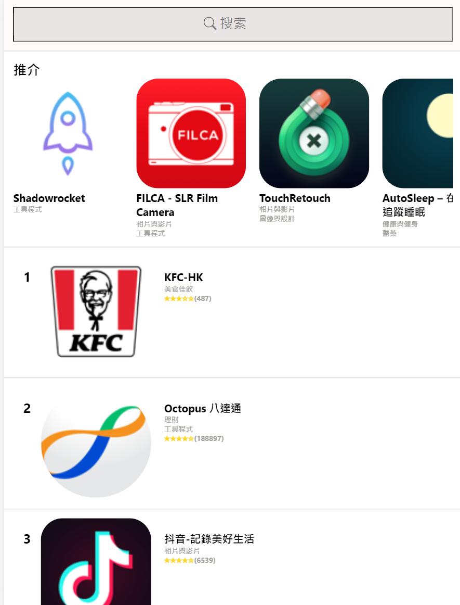

# Description

 Getting the data from "https://rss.applemarketingtools.com/" and bulid up the App Store listing page by ReactJS, CSS, HTML, Node js.

# Getting Started

In order to start the project, please `npm install` first, make sure you are in the right path,which has the package.json.
Then, do `npm start` to start the front-end project and open another terminal for the back-end server.
Go to the path "./server", do `node server.js` to start the server,which is written by Node js.

## Why do I set up a server?

The reason why I need to have a backend Serve is that broswer block the API CALL from "localhost:3000" to
"https://rss.applemarketingtools.com/" becasue of the CROS policy. Therefore, I need to set a back-end server
to directly call the API without the broswer.

## LazyLoading

The API from "https://rss.applemarketingtools.com/" is not supported to get 10 elements each times. You
can choose to get 10 or 25 or 50 items once. Therefore, I may get more than 10 items from the API call of
"https://rss.applemarketingtools.com/". After the filtering in the back-end server by the "Limit" parameter,
my server return the needed 10 elements to the front-end. The already existed data wiil not be replaced,
the LazyLoading is succeeded,

#

Create React App
This project was bootstrapped with [Create React App](https://github.com/facebook/create-react-app).

## Available Scripts

In the project directory, you can run:

### `npm start`

Runs the app in the development mode.\

The page will reload when you make changes.\
You may also see any lint errors in the console.

### `npm test`

Launches the test runner in the interactive watch mode.\

### `npm run build`

Builds the app for production to the `build` folder.\
It correctly bundles React in production mode and optimizes the build for the best performance.

The build is minified and the filenames include the hashes.\
Your app is ready to be deployed!

### `npm run eject`

**Note: this is a one-way operation. Once you `eject`, you can't go back!**

If you aren't satisfied with the build tool and configuration choices, you can `eject` at any time. This command will remove the single build dependency from your project.

Instead, it will copy all the configuration files and the transitive dependencies (webpack, Babel, ESLint, etc) right into your project so you have full control over them. All of the commands except `eject` will still work, but they will point to the copied scripts so you can tweak them. At this point you're on your own.

You don't have to ever use `eject`. The curated feature set is suitable for small and middle deployments, and you shouldn't feel obligated to use this feature. However we understand that this tool wouldn't be useful if you couldn't customize it when you are ready for it.
